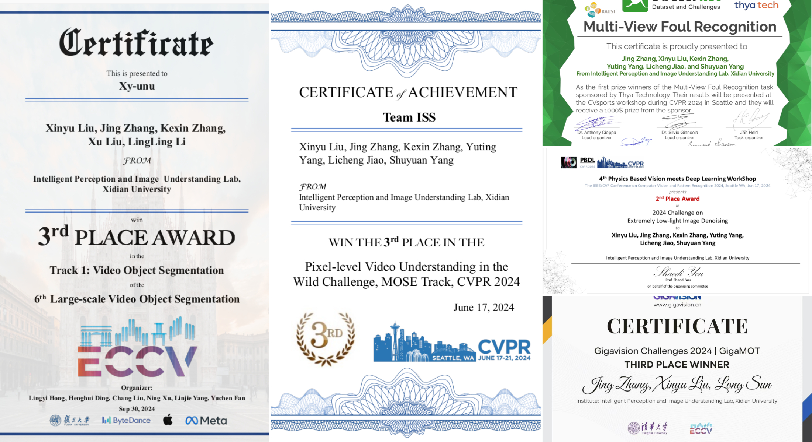
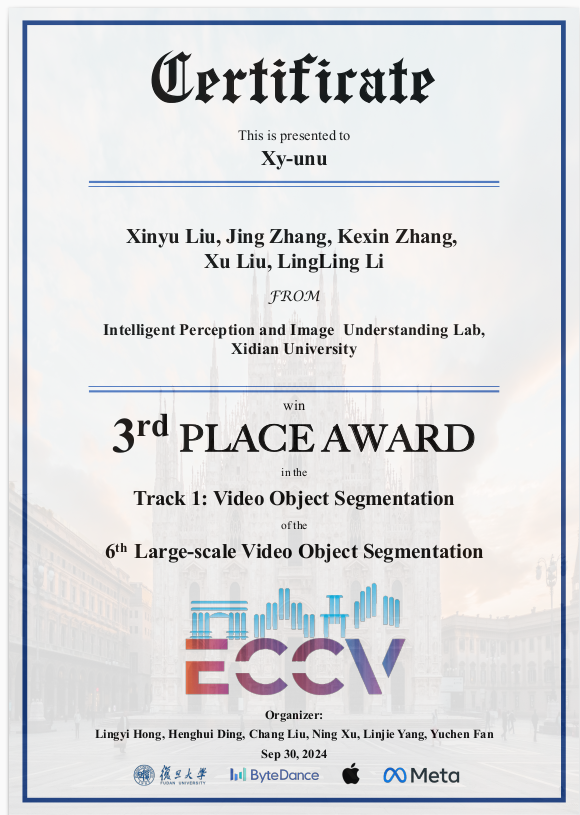
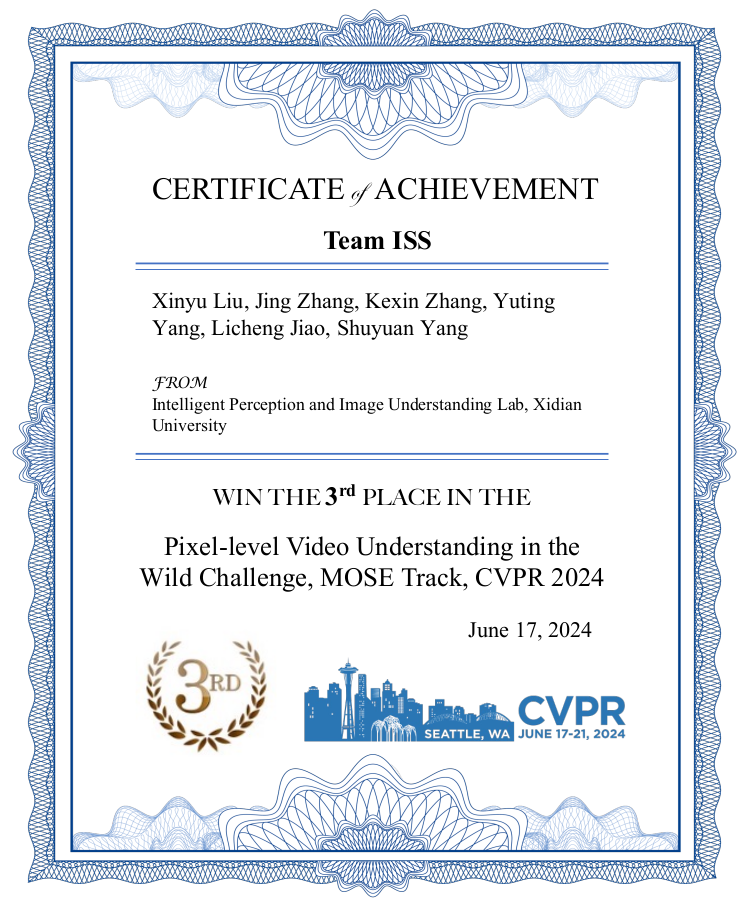
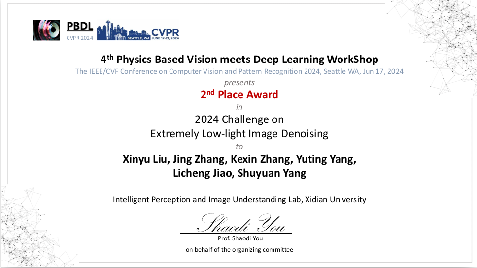
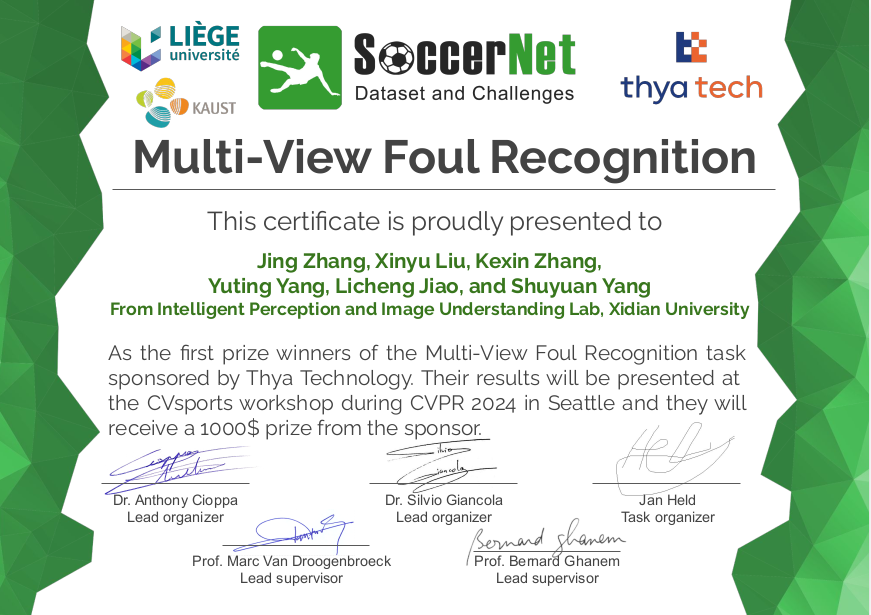
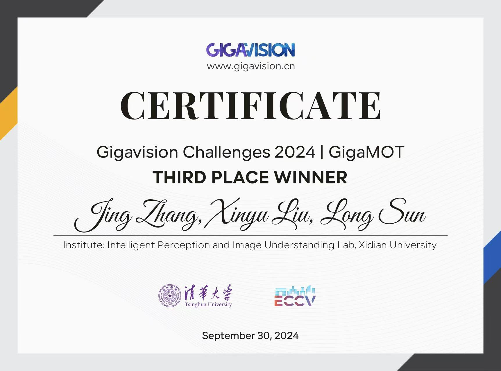

> "What's past is prologue."  -- William Shakespeare  
 

> Lastest Update: 20th Sep 2024 &nbsp; [Chinese Version](https://xxxxyliu.github.io/file/awards-zh)

## Scholarships

- 2024.11: First-class Scholarship, Xidian University.
- 2023.11: Freshman First-class Scholarship, Xidian University.
- 2020-2021, 2021-2022: National Encouragement Scholarship of China Ministry of Education.
- 2019-2023: First-Class Scholarship from Shanxi University for *four consecutive years.*

## Competitions

- 2024.09: **Third Place**: [GigaMOT](https://gigavision.cn/track/track/?nav=Tracking&type=nav&t=1734165651038), ECCV 2024.
- 2024.08: **Third Place**: [THE 6TH LSVOS CHALLENGE - VOS Track](https://lsvos.github.io/#leadboard) - VOS Track, ECCV 2024.
- 2024.05: **First Place**: [SoccerNet-Multi-View Foul Recognition](https://www.soccer-net.org/challenges/2024), CVPR 2024.
- 2024.04: **Second Place**: [Low-light Raw Image Enhancement](https://pbdl-ws.github.io/pbdl2024/Low-light%20Raw%20Image%20Enhancement/index.html), CVPR 2024.
- 2024.06: **Third Place**: [Complex Video Object Segmentation Challenge](https://henghuiding.github.io/MOSE/ChallengeCVPR2024) (MOSE Track), CVPR 2024.
 

 

<!--  -->

<!-- 

 -->

## Social Achievements
- 2022-2023: Outstanding Youth Volunteer of Shanxi University (Top 1% among registered volunteers at the college level)
- 2019-2020,2022-2023: Outstanding Student of Shanxi University 
- 2021-2022: Excellent Psychological Committee Member

 
